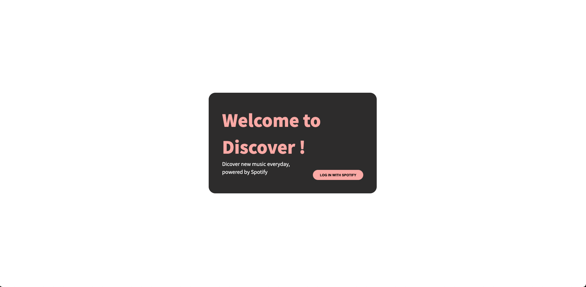
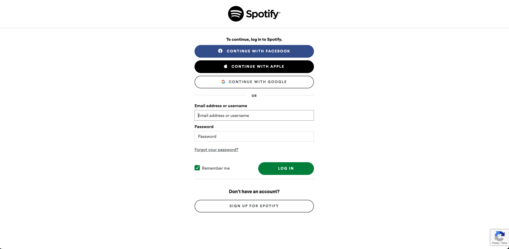

[](https://shields.io/)
[](https://shields.io/)
[](https://shields.io/)

# Discover

Discover is an music recommendation application which utilize Spotify API

## Screen Shot
### Start Page


### Login Page


### Home Page


## Installation

Make a copy of config.example.env.js and rename to config.env.js

Create Spotify Developer account at https://developer.spotify.com/dashboard/ to get CLIENT ID, CLIENT SECRET, AND PLAYBACK SDK KEY

CLIENT_ID: {YOUR CLIENT ID KEY}

CLIENT_SECRET: {YOUR CLIENT SECRET KEY}

PLAYBACK_SDK: {YOUR PLAYBACK SDK KEY}

Make a copy of config.example.env and rename to config.env

CLIENT_ID: {YOUR CLIENT ID KEY}

CLIENT_SECRET: {YOUR CLIENT SECRET KEY}

Use the package manager [npm](https://www.npmjs.com/get-npm) to install Patagucci.

```bash
npm install
npm run build
npm run start
```


## Features
- Six recommendation options based on user's spotify information
- Show album information
- Play thirty sec